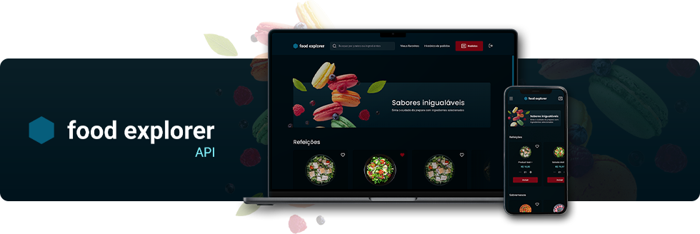

# Food Explorer API - Node.js

API Resftul, em `Node.js`, com propósito de gerenciar um sistema de cardápio on-line de um restaurante fictício. Ela fornece _endpoints_ para realizar operações de usuários, produtos e pedidos. Foi desenvolvida como conclusão da trilha Explorer, no curso de desenvolvimento Full Stack da Rocketseat.

O projeto segue uma estrutura modular e organizada, incluindo módulos separados para gerenciamento de usuário, produtos e pedidos, seguindo estratégias como o Princípio da Inversão de Dependências.

As rotas são tratadas utilizando `Express.js`, com _upload_ de imagem utilizando `multer`. As operações de banco de dados são gerenciadas com `Knex.js` e `SQLite 3`, contando com autenticação e autorização de requisições utilizando `JSON Web Token`.

## Tecnologias e bibliotecas


`knex.js` `cors` `bcryptjs` `jsonwebtoken` `multer` `cookie-parser`

## Características

A API possui três níveis de autorização: visitante, cliente e administrador. Cada nível possui as seguintes permissões:

```bash
# Visitante
- Iniciar sessão
- Criar conta
```

```bash
# Cliente
- Todas as permissões acima
- Visualizar e pesquisar produtos
- Gerenciar carrinho de compras e favoritos
- Realizar e consultar pedidos
```

```bash
# Administrador
- Todas as permissões acima
- Gerenciar produtos (adicionar, alterar e excluir)
- Gerenciar pedidos (visualizar e alterar status)
```

---

Confira a aplicação Front-End desenvolvida para esta API [clicando aqui](https://github.com/julianosill/rocketseat-food-explorer-web).

---

## _Live preview_

O _live preview_ desta API está hospedada no serviço [Render](https://render.com).

_Obs.: Está com autorização apenas para requisições feitas através do domínio da aplicação Front-End deste projeto, que pode ser conferida [neste link](https://github.com/julianosill/rocketseat-food-explorer-web)._

## 📚 Índice

- [Funções](#funções)
- [Instalação](#instalação)
  - [Incluindo variáveis de ambiente](#incluindo-variáveis-de-ambiente)
  - [Executando localmente](#executando-localmente)
  - [Criando usuário administrador](#criando-usuário-administrador)
- [API _endpoints_](#api-endpoints)
- [Requisições](#requisições)
  - **Usuários**
    - [Criar usuário](#criar-usuário)
    - [Validar usuário](#validar-usuário)
    - [Atualizar usuário](#atualizar-usuário)
    - [Excluir usuário](#excluir-usuário)
    - [Iniciar sessão](#iniciar-sessão)
  - **Produtos**
    - [Listar produtos](#listar-produtos)
      - [Listar produtos: queries](#listar-produtos-queries)
    - [Obter produto](#obter-produto)
    - [Criar produto](#criar-produto)
    - [Atualizar dados do produto](#atualizar-dados-do-produto)
    - [Enviar ou atualizar imagem do produto](#enviar-ou-atualizar-imagem-do-produto)
    - [Excluir produto](#excluir-produto)
  - **Pedidos**
    - [Listar pedidos](#listar-pedidos)
    - [Criar pedido](#criar-pedido)
    - [Atualizar pedido](#atualizar-pedido)
  - **Categorias**
    - [Listar categorias](#listar-categorias)
    - [Obter categoria](#obter-categoria)
    - [Criar categoria](#criar-categoria)
    - [Atualizar categoria](#atualizar-categoria)
    - [Excluir categoria](#excluir-categoria)
- [Respostas](#respostas)
  - [Sucesso](#sucesso)
  - [Erros](#erros)
    - [Erros de usuário](#erros-de-usuário)
    - [Erros de produto](#erros-de-produto)
    - [Erros de imagen](#erros-de-imagen)
    - [Erros de pedido](#erros-de-pedido)
    - [Erros de categoria](#erros-de-categoria)

---

## Funções

### Requisições de usuários

- Criação / Alteração / Exclusão
- Início de sessão
- Validação de usuário

### Requisições de produtos

- Criação / Alteração / Exclusão / Listagem
- Upload de imagem
- Obter produto

### Requisições de pedidos

- Criação / Alteração / Listagem

### Requisições de categorias

- Criação / Alteração / Exclusão / Listagem
- Obter categoria

---

## Instalação

Clone este repositório executando o comando:

```bash
git clone https://github.com/julianosill/rocketseat-food-explorer-api.git
```

Acesse a pasta do projeto e instale as dependências necessárias:

```bash
cd rocketseat-food-explorer-api
npm install
```

### Incluindo variáveis de ambiente

Crie um arquivo chamado `.env` ou (renomeie o aquivo `.env_sample`) na pasta raíz do projeto seguindo o padrão abaixo:

```bash
# SERVER

# porta de sua preferência
PORT=XXXX
# domínio da sua aplicação Front-End
CORS_ORIGIN=url_da_sua_aplicacao

# DATABASE
DB_CLIENT=sqlite3
DB_NAME=nomedoseubanco.db

# JWT
AUTH_SECRET=chavesecreta
```

### Executando localmente

Execute a aplicação localmente com o seguinte comando:

```bash
npm run server
```

O comando irá criar o banco de dados e executará as migrações. Em seguida, iniciará o servidor local exibindo a seguinte mensagem: `Server is running on port XXXX`

A API estará disponível na porta estabelecida pela variável de ambiente ou `3333` (padrão), através da URL `http:/localhost:PORT`. Exemplo: [http:/localhost:3333](http:/localhost:3333)

### Criando usuário administrador

Ao registrar um usuário, se este for o primeiro, será automaticamente definido como um perfil de Administrador. Todos os usuários posteriores serão registrados como Cliente.

---

## API _endpoints_

### Rotas de usuários

- POST `/users`: criar usuário
- GET `/users/validate`: validar usuário
- PUT `/users/:id`: atualizar usuário
- DELETE `/users/:id`: remover usuário

### Rota de sessão

- POST `/sessions`: iniciar sessão

### Rotas de produtos

- GET `/products`: listar produtos
- GET `/products/:id`: obter produto
- POST `/products`: criar produto
- PUT `/products/:id`: atualizar produto
- PATCH `/products/image/:product_id`: enviar ou atualizar imagem do produto
- DELETE `/products/:id`: remover produto

### Rotas de pedidos

- GET `/orders`: listar pedidos
- POST `/orders`: criar pedido
- PUT `/orders/:id`: atualizar pedido

### Rotas de categorias

- GET `/categories`: listar categorias
- GET `/categories/:id`: obter categoria
- POST `/categories`: criar categoria
- PUT `/categories/:id`: atualizar categoria
- DELETE `/categories/:id`: remover categoria

---

## Requisições

Todas as requisições devem ser realizadas incluindo _cookies_. Este irá conter o JWT token gerado ao iniciar a sessão do usuário.

### Criar usuário

Faça uma requisição ao _endpoint_ `/users`, utilizando o método `POST`, enviando os seguintes dados em seu corpo:

```js
{
  name: "string",
  email: "string",
  password: "string"
}
```

### Validar usuário

Faça uma requisição ao _endpoint_ `/users/validate` utilizando o método `GET`.

### Atualizar usuário

Faça uma requisição ao _endpoint_ `/users/:id`, utilizando o método `PUT`, enviando os seguintes dados em seu corpo:

```js
{
  name: "string",
  email: "string",
  current_password: "string ou number",
  new_password: "string ou number",
}
```

### Excluir usuário

Faça uma requisição ao _endpoint_ `/users/:id`, utilizando o método `DELETE`, enviando os seguintes dados em seu corpo:

```js
{
  password: "string ou number",
  confirm_password: "string ou number",
}
```

---

### Iniciar sessão

Faça uma requisição ao _endpoint_ `/sessions`, utilizando o método `POST`, enviando os seguintes dados em seu corpo:

```js
{
  email: "string",
  password: "string"
}
```

> **Retorno**
>
> A requisição irá retornar um _cookie_ contendo o JWT token, gerado ao iniciar a sessão, e também os dados abaixo em seu corpo:
>
> ```json
> {
>   "user": {
>     "name": "string",
>     "email": "string",
>     "role": "admin ou customer"
>   }
> }
> ```

---

### Listar produtos

Faça uma requisição ao _endpoint_ `/products`, utilizando o método `GET`.

> **Retorno**
>
> ```json
> [
>   {
>     "id": "number",
>     "name": "string",
>     "description": "string",
>     "category": "string",
>     "price": "number",
>     "image": "string",
>     "created_at": "YYYY-MM-DD HH:MM:SS",
>     "updated_at": "YYYY-MM-DD HH:MM:SS",
>     "ingredients": ["string", "string", "string"]
>   }
> ]
> ```

#### Listar produtos: queries

Utilize queries para filtrar ou pesquisar produtos específicos.

| Query          | Opções                                              | Exemplos                       |
| -------------- | --------------------------------------------------- | ------------------------------ |
| `search=`      | nome do produto ou ingrediente _(exato ou parcial)_ | `/products?search=tomat`       |
| `id=`          | ID ou lista de IDs _(separados por vírgula)_        | `/products?id=2,4,5,6`         |
| `name=`        | nome do produto                                     | `/products?name=salada`        |
| `ingredients=` | ingrediente _(nome exato)_                          | `/products?ingredients=cebola` |
| `category=`    | categoria _(nome exato)_                            | `/products?category=Bebidas`   |

É possível combinar mais opções, por exemplo: `/products?ingredients=chocolate&category=Sobremesas`

### Obter produto

Faça uma requisição ao _endpoint_ `/products/:id`, utilizando o método `GET`.

> **Retorno**
>
> ```json
> {
>   "id": "number",
>   "name": "string",
>   "description": "string",
>   "category": "string",
>   "price": "number",
>   "image": "string",
>   "created_at": "YYYY-MM-DD HH:MM:SS",
>   "updated_at": "YYYY-MM-DD HH:MM:SS",
>   "ingredients": ["string", "string", "string"]
> }
> ```

### Criar produto

Faça uma requisição ao _endpoint_ `/products`, utilizando o método `POST`, enviando os seguintes dados em seu corpo:

```js
{
  name: "string",
  description: "string",
  category: "string",
  ingredients: ["string", "string", "string"],
  price: Number,
}
```

> **Retorno**
>
> ```json
> {
>   "id": "number",
>   "name": "string",
>   "description": "string",
>   "category": "string",
>   "price": "number",
>   "ingredients": ["string", "string", "string"]
> }
> ```

### Atualizar dados do produto

Faça uma requisição ao _endpoint_ `/products`, utilizando o método `PUT`, enviando os seguintes dados em seu corpo:

```js
{
  name: "string",
  description: "string",
  category: "string",
  ingredients: ["string", "string", "string"],
  price: Number,
}
```

### Enviar ou atualizar imagem do produto

Faça uma requisição ao _endpoint_ `/products/image/:product_id`, utilizando o método `PATCH`, enviando a imagem em formato 'PNG'.

### Excluir produto

Faça uma requisição ao _endpoint_ `/products/:id`, utilizando o método `DELETE`.

---

### Listar pedidos

Faça uma requisição ao _endpoint_ `/orders`, utilizando o método `GET`.

> **Retorno**
>
> ```json
> [
>   {
>     "id": "number",
>     "status": "string",
>     "description": "string",
>     "user_id": "number",
>     "created_at": "YYYY-MM-DD HH:MM:SS",
>     "updated_at": "YYYY-MM-DD HH:MM:SS"
>   }
> ]
> ```

### Criar pedido

Faça uma requisição ao _endpoint_ `/orders`, utilizando o método `POST`, enviando os seguintes dados em seu corpo:

```js
{
  description: 'string'
}
```

### Atualizar pedido

Faça uma requisição ao _endpoint_ `/orders/:id`, utilizando o método `PUT`, enviando os seguintes dados em seu corpo:

```js
{
  status: 'pending', 'progress' ou 'delivered'
}
```

---

### Listar categorias

Faça uma requisição ao _endpoint_ `/categories`, utilizando o método `GET`.

> **Retorno**
>
> ```json
> [
>   {
>     "id": "number",
>     "name": "string"
>   }
> ]
> ```

### Obter categoria

Faça uma requisição ao _endpoint_ `/categories/:id`, utilizando o método `GET`.

> **Retorno**
>
> ```json
> [
>   {
>     "id": "number",
>     "name": "string",
>     "total": "number",
>     "products": [
>       {
>         "id": "number",
>         "name": "string",
>         "description": "string",
>         "category": "string",
>         "price": "number",
>         "image": "string",
>         "created_at": "YYYY-MM-DD HH:MM:SS",
>         "updated_at": "YYYY-MM-DD HH:MM:SS"
>       }
>     ]
>   }
> ]
> ```

### Criar categoria

Faça uma requisição ao _endpoint_ `/categories`, utilizando o método `POST`, enviando os seguintes dados em seu corpo:

```js
{
  name: 'string'
}
```

### Atualizar categoria

Faça uma requisição ao _endpoint_ `/categories/:id`, utilizando o método `PUT`, enviando os seguintes dados em seu corpo:

```js
{
  name: 'string'
}
```

### Excluir categoria

Faça uma requisição ao _endpoint_ `/categories/:id`, utilizando o método `DELETE`.

---

## Respostas

### Sucesso

Algumas requisições bem sucedidas retornam uma mensagem indicando seu sucesso. A resposta seguirá o padrão abaixo:

```json
{ "message": "mensagem de sucesso" }
```

Respostas para cada tipo de requisição:

- Usuários: `user-created` `user-updated` `user-deleted`
- Produtos: `product-updated` `product-deleted`, `image-updated`
- Pedidos: `order-created` `order-updated`
- Categorias: `category-created` `category-updated` `category-deleted`

---

### Erros

Lista de erros retornados em falhas de requisições por dados incorretos ou requisições fora do padrão estabelecido.

### Erros de usuário

| Mensagem                           | Descrição                                                  |
| ---------------------------------- | ---------------------------------------------------------- |
| `auth/current-password-is-missing` | A senha atual não foi informada.                           |
| `auth/email-already-exists`        | O e-mail informado já registrado no banco de dados.        |
| `auth/email-or-password-incorrect` | O e-mail e/ou senha informados estão incorretos.           |
| `auth/incorrect-password`          | A senha senha informada está incorreta.                    |
| `auth/invalid-email`               | O e-mail informado está em formato inválido.               |
| `auth/jwt-token-invalid`           | O token JWT é inválido ou está incorreto.                  |
| `auth/jwt-token-not-found`         | O token JWT não foi encontrado.                            |
| `auth/name-is-missing`             | O nome não foi informado.                                  |
| `auth/new-password-is-missing`     | A nova senha não informada.                                |
| `auth/password-does-not-match`     | As senhas não são equivalentes.                            |
| `auth/password-too-short`          | Senha muito curta, deve conter 6 ou mais caracteres.       |
| `auth/unauthorized`                | O usuário não possui permissão para realizar a requisição. |
| `auth/user-not-found`              | O usuário não foi encontrado ou não está registrado.       |

### Erros de produto

| Mensagem                          | Descrição                                                                       |
| --------------------------------- | ------------------------------------------------------------------------------- |
| `product/category-is-missing`     | A categoria do produto não foi informada.                                       |
| `product/description-is-missing`  | A descrição do produto não foi informada.                                       |
| `product/ingredients-are-missing` | Os ingredientes do produto não foram informados.                                |
| `product/name-already-exists`     | O nome do produto já está registrado.                                           |
| `product/name-is-missing`         | O nome do produto não foi informado.                                            |
| `product/price-is-missing`        | O preço do produto não foi informado.                                           |
| `product/price-is-not-a-number`   | O preço do produto deve estar em formato 'número'.                              |
| `product/product-not-found`       | O produto solicitado não foi encontrado ou não está registrado.                 |
| `product/products-not-found`      | Não foram encontrados produtos registrados ou nenhum atende ao filtro definido. |

### Erros de imagen

| Mensagem                      | Descrição                                        |
| ----------------------------- | ------------------------------------------------ |
| `image/image-is-missing`      | A imagem do produto não foi incluída.            |
| `image/image-must-be-png`     | A imagem do produto deve estar em formato 'PNG'. |
| `image/product-id-is-missing` | O ID do produto não foi informado.               |

### Erros de pedido

| Mensagem                           | Descrição                                                                      |
| ---------------------------------- | ------------------------------------------------------------------------------ |
| `order/description-is-missing`     | A descrição do pedido não foi informada.                                       |
| `order/description-must-be-string` | A descrição do pedido deve estar em formato 'string'.                          |
| `order/id-is-missing`              | O ID do pedido não foi informado.                                              |
| `order/order-not-found`            | O pedido não foi encontrado ou não está registrado.                            |
| `order/orders-not-found`           | Não foram encontrados pedidos registrados ou nenhum atende ao filtro definido. |
| `order/status-is-missing`          | O status do pedido não foi informado.                                          |
| `order/user_id-is-missing`         | O ID do usuário do pedido não foi informado.                                   |

### Erros de categoria

| Mensagem                            | Descrição                                              |
| ----------------------------------- | ------------------------------------------------------ |
| `category/category-not-found`       | A categoria não foi encontrada ou não está registrada. |
| `category/name-already-exists`      | O nome da categoria já está registrado.                |
| `category/name-is-missing`          | O nome da categoria não foi informado.                 |
| `category/no-categories-registered` | Não há categorias registradas.                         |
